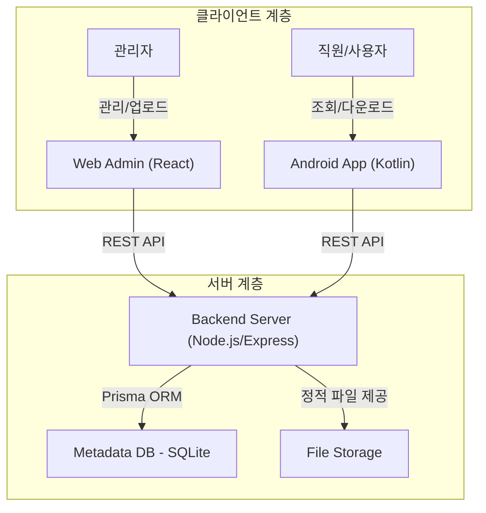

# 📱 Simple App Store

[](https://github.com/admin/kotlin_akstore_main)
[](docs/TRD.md)
[](docs/PRD.md)

**Simple App Store**는 사내 또는 특정 그룹 내에서 안드로이드 애플리케이션(APK)을 쉽고 빠르게 배포하고 관리하기 위한 경량화된 앱 배포 플랫폼입니다. 복잡한 마켓 심사 없이 즉시 앱을 등록하고 내부 사용자에게 안전하게 전달합니다.

---

## 🚀 Key Features

- **Quick APK Upload**: 웹 관리자 페이지를 통한 손쉬운 APK 업로드 및 메타데이터 관리.
- **Categorized Browsing**: 안드로이드 앱 및 웹에서 카테고리별로 정렬된 앱 리스트 제공.
- **Seamless Download & Install**: 모바일 단말기에서 즉시 다운로드 및 패키지 설치 지원.
- **Version Management**: 동일 패키지명의 버전별 관리 및 릴리즈 노트 확인.
- **Internal Security**: 특정 그룹 내 사용자만을 위한 안전한 배포 환경.

---

## 🏗️ System Architecture

Simple App Store는 중앙 관리형 서버를 중심으로 웹과 앱이 유기적으로 연결된 3-Tier 아키텍처를 따릅니다.



---

## 🛠️ Tech Stack

### Frontend & Admin
- **React.js + Vite**: 빠르고 모던한 웹 개발 환경.
- **TailwindCSS**: 생산성 높은 UI 스타일링.
- **Axios**: 효율적인 REST API 통신.

### Backend (Store Service)
- **Node.js (Express)**: 유연하고 확장 가능한 서버 엔진.
- **Prisma (ORM)**: 타입 안전한 데이터베이스 쿼리 및 관리.
- **SQLite**: 경량화된 파일 기반 데이터베이스 (PostgreSQL 확장 가능).

### Mobile (Android Client)
- **Kotlin + Jetpack Compose**: 선언적 UI 프레임워크를 통한 직관적 UX.
- **Retrofit**: 견고한 네트워크 통신 레이어.
- **DownloadManager**: 안정적인 대용량 파일 다운로드 처리.

---

## 📂 Project Structure

```text
.
├── android_app             # 안드로이드 클라이언트 프로젝트
│   ├── app                 # Kotlin/Compose 앱 소스
│   └── ...
├── storeservice            # 웹 및 백엔드 통합 폴더
│   ├── backend             # Express API 서버 (Prisma, Uploads)
│   ├── frontend            # React 어드민 페이지
│   └── docker-compose.yml  # 서버 배포 구성
└── docs                    # 제품 및 기술 가이드 문서
    ├── PRD.md              # 제품 요구사항 정의서
    ├── TRD.md              # 기술 요구사항 정의서
    ├── ARCHITECTURE.md     # 시스템 아키텍처
    └── DESIGN.md           # 디자인 가이드 시스템
```

---

## 🏁 Getting Started

### 1. Backend & Web (Store Service)
```bash
cd storeservice/backend
npm install
npx prisma migrate dev
npm run dev

cd ../frontend
npm install
npm run dev
```

### 2. Android App
- `android_app` 폴더를 Android Studio로 엽니다.
- `local.properties` 또는 `.env`에 서버 API Base URL을 설정합니다.
- `Run` 버튼을 클릭하여 에뮬레이터 또는 실기기에서 실행합니다.

---

## 📄 Documentation

상세한 개발 가이드 및 설계 내용은 [docs/](docs/) 디렉토리의 문서들을 참조해 주세요.

- [전체 배포 가이드](docs/deploy-linux.md)
- [사용자 매뉴얼](docs/USER_MANUAL.md)

---

## 🤝 Contribution Guidelines

프로젝트 참여 및 코드 기여를 원하시는 분은 `README_OLD.md`의 [Commit & PR Guide](README_OLD.md#커밋-및-pr-가이드)를 확인해 주세요.

---

© 2026 Simple App Store Team. Licensed under the MIT License.
